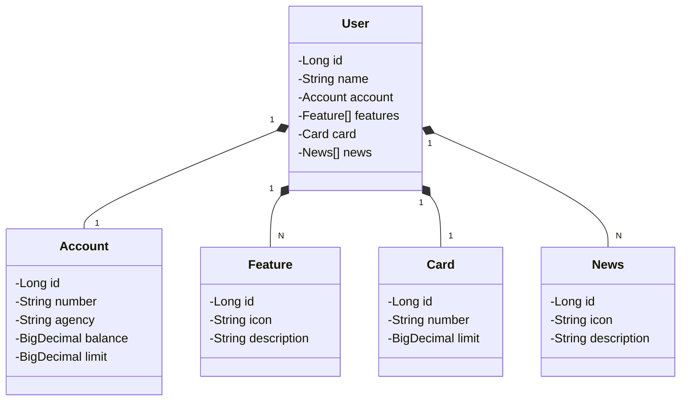

# 🚀 Santander Dev Week 2023 - RESTful API

API RESTful desenvolvida durante o bootcamp **Santander Dev Week 2023** em parceria com a **DIO (Digital Innovation One)**, projetada para simular os serviços backend de uma aplicação bancária digital moderna.

---

## 📌 Visão Geral da Arquitetura e Engenharia

A aplicação adota uma arquitetura em camadas focada em desacoplamento, legibilidade e facilidade de manutenção (**Clean Code** e princípios **SOLID**):

- **Controller Layer:** Exposição dos endpoints REST e gestão das requisições HTTP.
- **Service Layer:** Centralização das regras de negócio e validações do domínio.
- **Repository Layer:** Abstração de persistência de dados com Spring Data JPA.
- **Exception Handling:** Tratamento centralizado de exceções (`@RestControllerAdvice`) garantindo respostas HTTP padronizadas.

---

## 🛠️ Tecnologias e Dependências

| Tecnologia | Finalidade |
| :--- | :--- |
| **Java 21 (LTS)** | Linguagem base da aplicação |
| **Spring Boot 3.1.x** | Framework backend principal |
| **Spring Data JPA** | ORM e facilidade de acesso a dados |
| **PostgreSQL** | Banco de dados relacional para ambiente de **Produção** |
| **H2 Database** | Banco de dados em memória para testes e desenvolvimento **Local** |
| **SpringDoc OpenAPI / Swagger 2.1.0** | Documentação interativa e especificação da API |
| **Maven** | Gerenciamento de dependências e build da aplicação |
| **Railway** | Plataforma de hospedagem PaaS (Cloud e CI/CD) |

---

## 📐 Diagrama de Classes do Domínio

 # 👨‍💻 Desenvolvedor
  Dyorgenes Proença

GitHub: @DyorgenesProenca

